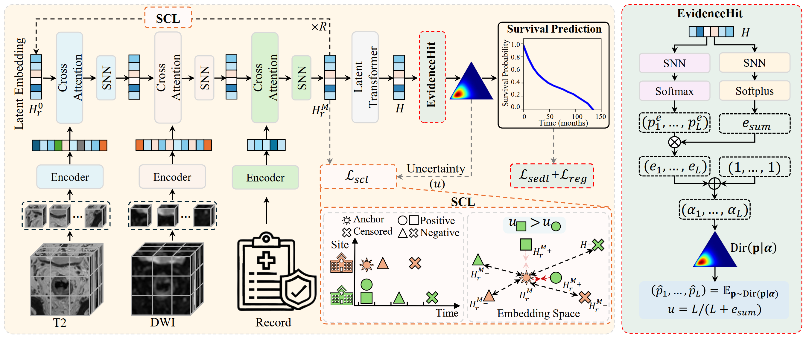
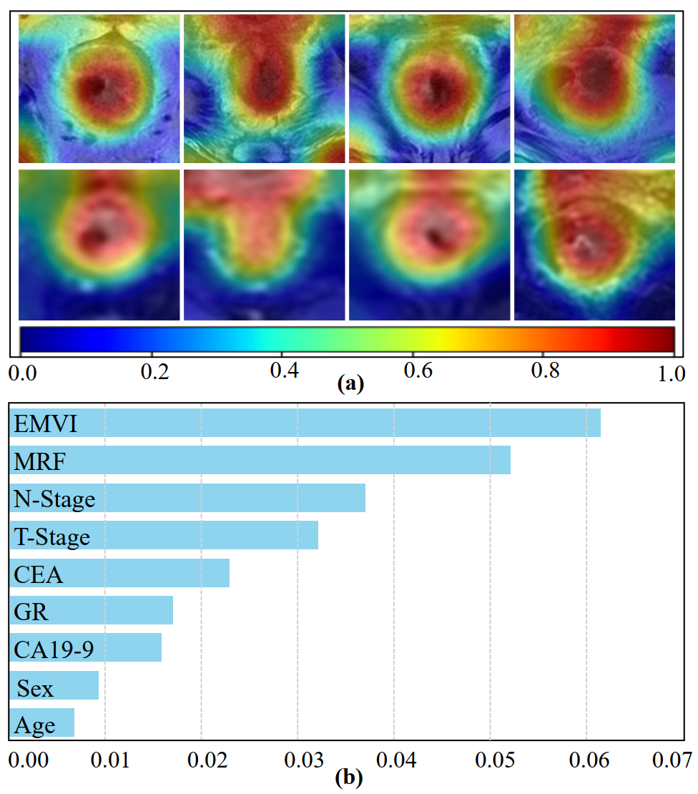

# 不确定性引导迭代对比融合术用于直肠癌的可靠生存预测——UICSurv （TMI）
## 核心创新点 (Core Innovations)

该研究提出了 UICSurv 框架，其核心创新点主要体现在以下三个方面：

* **生存对比学习 (SCL, Survival Contrastive Learning)**：提出了一种针对生存预测任务量身定制的对比学习策略。它通过在特征空间中拉近来自不同站点但生存时间相同的“正样本”，并根据生存时间差异推开“负样本”，从而逐步增强多模态嵌入的跨站点对齐能力和生存判别力。
* **不确定性引导融合 (Uncertainty-guided Fusion)**：利用样本级别的不确定性对可靠性较低（高不确定性）的正样本进行降权。这种机制有效减少了噪声和不可靠样本对特征融合过程的干扰，提升了对齐的稳定性。
* **时间一致的证据学习模块 (EvidenceHit)**：引入了证据深度学习 (EDL)，不仅能联合估计生存概率和样本级不确定性，还设计了特殊的时间一致性正则化项 $\mathcal{L}_{reg}$。该正则化项通过压缩非事件时间点的多余证据，克服了传统方法忽视生存标签时间相关性的缺陷。

## 模型架构 (Model Architecture)

UICSurv 框架的运行机制由两个高度协同的阶段组成：

* **第一阶段：不确定性引导的多模态融合**
    模型初始化一个共享的潜在嵌入，并通过交叉注意力机制迭代地融合来自 T2 影像、DWI 影像和临床记录的异质特征。在每次迭代中，SCL 策略会在生存/删失时间和不确定性评分的双重引导下发挥作用，逐步优化嵌入空间。由于采用了迭代融合机制，该模型能够非常灵活地处理训练和推理阶段的模态缺失问题（如跳过缺失的 DWI 数据）。
* **第二阶段：不确定性感知生存预测**
    经过多轮迭代后的最终多模态嵌入被送入 EvidenceHit 模块。该模块通过狄利克雷分布 (Dirichlet distribution) 建模离散的事件时间分布，联合优化生存预测损失 $\mathcal{L}_{sedl}$ 和正则化项 $\mathcal{L}_{reg}$。它在输出生存预测曲线的同时，还会向第一阶段的 SCL 反馈不确定性评分，形成闭环指导。

## 实验设置 (Experiments)

* **数据集**：研究使用了来自三个不同临床站点（北京肿瘤医院、复旦大学附属肿瘤医院和山西省肿瘤医院）共 1,053 名直肠癌患者的多模态数据集。

* **验证协议**：为了严格测试跨站点泛化能力，实验采用了“留一站点验证” (Leave-one-site-out) 设置，即用两个站点训练验证，用剩下的一个完全陌生的站点进行外部测试，并结合五折交叉验证。

* **评估指标**：主要使用一致性指数 (C-index) 来评估生存排序的准确性，以及综合 Brier 分数 (IBS) 来评估模型在整个时间轴上的生存函数预测绝对误差。

  C-index关注的是相对排序，即所有可比样本中，预测排序与实际生存排序一致的比例。所以**越大越好**。

  IBS是在每一个时间点，计算模型预测的生存概率与实际观测结果（生或死）之间的平方误差（即 Brier Score） 。将这些误差在整个时间跨度内进行积分并取平均值。所以**越小越好**。

## 主要结果 (Results)

* **卓越的预测性能**：无论是在数据完整的场景，还是在部分模态缺失的场景下，UICSurv 的 C-index 和 IBS 均显著优于 HEALNET、Pathomic Fusion、Perceiver 等现有的先进方法。

* **高精度的风险分层**：Kaplan-Meier 生存曲线结果表明，UICSurv 能够以极高的统计显著性（p-value = 1.09e-08）将患者区分为高风险组和低风险组，展现了强大的临床辅助诊断潜力。

* **可靠的不确定性估计**：实验证实，EvidenceHit 模块输出的不确定性与 IBS 预测误差呈强正相关（Spearman 相关系数达 0.83）。这意味着模型估算出的“高不确定性”确实对应了现实中预测误差较大的离群或复杂病例。

* **极强的缺失模态鲁棒性**：在训练和测试阶段 DWI 缺失率高达 50% 的极端情况下，UICSurv 的性能下降幅度远小于基准模型 HEALNET，证明了其特征空间的稳健性。

* ⭐**临床可解释性验证**：特征重要性热力图显示，模型准确地将注意力集中在了直肠肿瘤病灶及邻近组织上 。此外，SHAP 分析指出，脉管浸润 (EMVI)、肠系膜筋膜状态 (MRF)、N 分期和 T 分期是对生存预测贡献最大的临床变量，这与现有的医学共识完全吻合。
